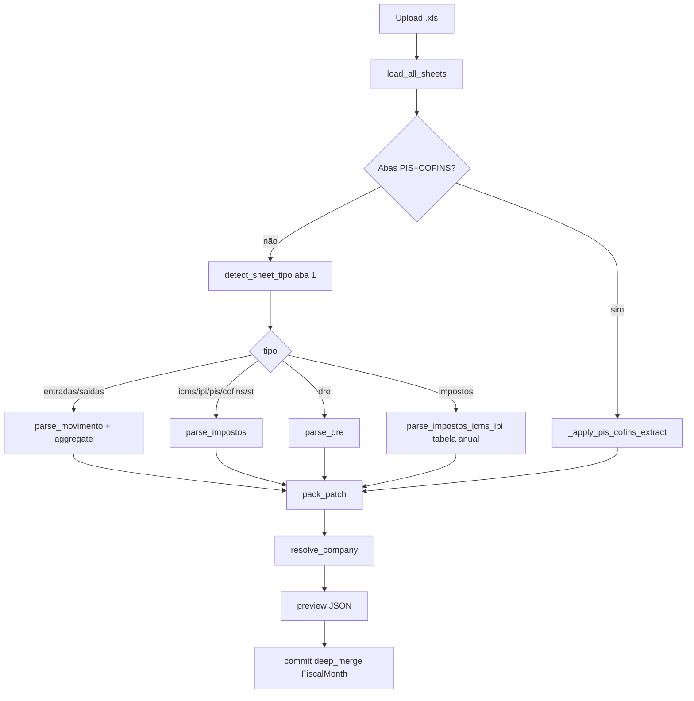

# Arquitetura — nova-versao import

## Stack

```
Browser (:3000 Next.js)
    → /api/imports/preview|commit (proxy)
        → FastAPI (:8001) routers/imports.py
            → classify_and_extract (pipeline.py)
                → workbook / classify / parse_* / aggregate
            → Postgres: FiscalMonth.pack (JSON), NfeLine, ImportRecord
```

**Não confundir** com dashboard EJS (`npm start` raiz, porta 4243).

## Fluxo de dados



## Módulos Python

| Módulo | Funções principais |
|--------|-------------------|
| `workbook.py` | `load_workbook`, `load_all_sheets`, `WorkbookGrid`, parsers xlrd/openpyxl/COM |
| `classify.py` | `scan_cnpj`, `scan_period`, `competencia_from_filename`, `detect_sheet_tipo`, `resolve_company`, `is_multi_month_movimento` |
| `parse_movimento.py` | `parse_movimento`, detecção header dinâmica, `_find_total_geral` |
| `aggregate.py` | `aggregate`, `merge_entradas`, `merge_saidas`, `validate_movimento` |
| `parse_impostos.py` | `parse_demonstrativo_icms`, `parse_demonstrativo_ipi`, `parse_demonstrativo_pis_cofins`, `parse_st_mensal`, `parse_impostos_icms_ipi`, `apuracao_patch_from_demo` |
| `parse_memoria_5005.py` | `parse_apuracao_5005`, `apuracao_patch_from_5005` → `memoriaCalculo` + ICMS/subvenção |
| `parse_dre.py` | `parse_dre` |
| `pipeline.py` | `classify_and_extract` — ponto único de entrada |
| `companies.py` | `COMPANIES`, `find_by_cnpj`, `resolve_from_db` |
| `routers/companies.py` | `_slice(aba, pack)` — fatia pack por aba do dashboard |
| `routers/imports.py` | `preview`, `commit`, `_apply_session_company`, `_inherit_batch_competencia` |

## Contrato `classify_and_extract`

Entrada: `path`, opcional `data: bytes`, opcional `db: Session`.

Saída (dict):

```python
{
    "file": str,           # nome original
    "sheet": str,          # aba principal (ou "PIS, COF" multi-aba)
    "parser": str,         # xlrd | com | html | ...
    "tipo": str,           # entradas | saidas | icms | pis_cofins | ...
    "cnpj": str,           # 14 dígitos
    "razao": str,
    "competencia": str,    # YYYY-MM
    "period": str,         # texto do período no cabeçalho
    "company_id": str | None,
    "company_label": str | None,
    "unidade": str,        # matriz | filial
    "errors": list[str],
    "warnings": list[str],
    "pack_patch": dict | None,
    "lines": list[dict],   # NF detalhe (movimento) — gravado em NfeLine
    "meta": dict,          # delta, nfs, aRecolher, ...
}
```

### `meta` por tipo

| tipo | meta típico |
|------|-------------|
| entradas/saidas | `totalGeralExcel`, `soma`, `nfs`, `delta`, `lineCount` |
| icms | `aRecolher`, `debitos`, `apurado` |
| pis_cofins | `pis`, `cofins` sub-dicts + `aRecolher` se aba única |
| icms_st | `aRecolher`, `ufs` |
| dre | `lineCount`, `hasValores` |

## Schema `pack_patch` (merge no FiscalMonth)

O pack é JSON acumulado por competência/unidade. `_deep_merge` sobrescreve chaves de mesmo nível; dicts aninhados merge recursivo.

### Movimento — entradas

```python
{
    "hasMovimentacao": True,
    "totalCompras": float,
    "nfsEntradas": int,
    "cfopDados": [{"cfop", "qtd", "total", "fornecedores": [...]}],
    "fornecedores": [{"nome", "doc", "uf", "qtd", "total"}],
    "porUf": [{"uf", "total", "qtd"}],
    "entradasMeta": {"totalGeralExcel", "soma", "delta", "cnpj", ...},
}
```

### Movimento — saídas

```python
{
    "hasMovimentacao": True,
    "cfopSaidasTotal": float,
    "receitaBruta": float,
    "nfsSaidas": int,
    "cfopSaidas": [...],
    "cfopSaidasDetalhe": [...],
    "clientes": [...],
    "clientesTop10": [...],
    "demaisClientes": float,
    "porUfSaidas": [...],
    "saidasMeta": {...},
}
```

### Apuração (impostos)

Via `apuracao_patch_from_demo(tributo, parsed)`:

```python
{
    "apuracao": {
        "icms": {"aRecolher", "apurado", "debitos", "creditos", ...},
        "ipi": {...},
        "pis": {...},
        "cofins": {...},
        "icmsSt": {...},
    },
    "composicao": {...},   # só se aRecolher ≠ 0
    "deducoes": {...},
    "porUfSt": [...],      # ST
}
```

### DRE

```python
{
    "hasDre": True,
    "dre": {"linhas", "receitaBruta", "lucBruto", "lucLiq", ...},
    "receitaBruta", "lucBruto", "lucLiq", "margMb", "margMl", "cmv",
}
```

## API `/api/imports`

### POST `/preview`

- Form: `files[]`, opcional `company_id` (empresa do dashboard)
- Por arquivo: `classify_and_extract(tmp, data, db=db)`
- `_apply_session_company`: valida planilha vs dashboard (catálogo estático = error; DB-only = warning)
- `duplicateHash`: SHA256 já em `ImportRecord`
- `slotExists`: já existe `FiscalMonth` para company+competencia+unidade
- `ok`: `not errors` e company_id e competencia presentes
- Retorna `previewId` (UUID em memória `_PREVIEWS`)

### POST `/commit`

Body: `{ previewId, replace?: bool, companyId?: str }`

- Recusa items com `errors` ou `ok: false`
- `replace: true` → zera `pack` e `NfeLine` do slot **uma vez** por commit
- Merge `pack_patch` no `FiscalMonth`
- Grava `ImportRecord` + `NfeLine` por linha (IntegrityError ignorado = NF duplicada)
- Preview expira após commit

### Comportamento merge multi-arquivo

Exemplo jul/2026 Baifer em **um** commit:

1. `Entradas 07-2026.xls` → cria/atualiza pack com compras
2. `Saídas 07-2026.xls` → merge vendas no **mesmo** FiscalMonth
3. `Apuração icms 072026.xls` → merge `apuracao.icms`

**Não** marcar replace ao adicionar segundo tipo no mesmo mês.

## Banco

| Tabela | Uso |
|--------|-----|
| `FiscalMonth` | `(company_id, competencia, unidade)` → `pack` JSON |
| `NfeLine` | Linhas NF movimento (nota, série, cfop, valor, …) |
| `ImportRecord` | Hash arquivo, tipo, meta audit |
| `Company` / `CompanyCnpj` | Empresas dinâmicas (além catálogo estático) |

## Dashboard slices

`_slice(aba, pack)` em `routers/companies.py` extrai dados por aba:

- `compras` ← totalCompras, fornecedores, cfopDados, porUf
- `vendas` ← cfopSaidasTotal, clientes, …
- `impostos` ← apuracao, composicao, deducoes
- `dre` ← dre, margens

Testes usam `_slice` para validar que import preenche aba correta.

## Leitura de workbook

Ordem de tentativa (Windows):

1. **xlrd** — `.xls` binário
2. **openpyxl** — `.xlsx`
3. **COM Excel** — fallback Windows
4. **HTML** — export malformado salvo como `.xls`

`load_all_sheets`: todas as abas (crítico PIS+COFINS).

`is_placeholder_bytes`: arquivo vazio/corrompido → `EMPTY_FILE_ERROR`.
